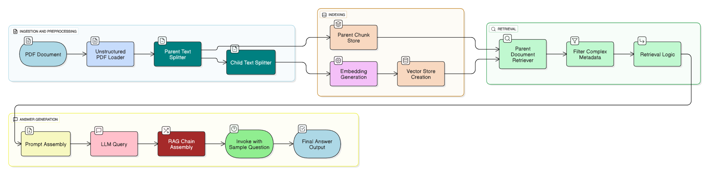
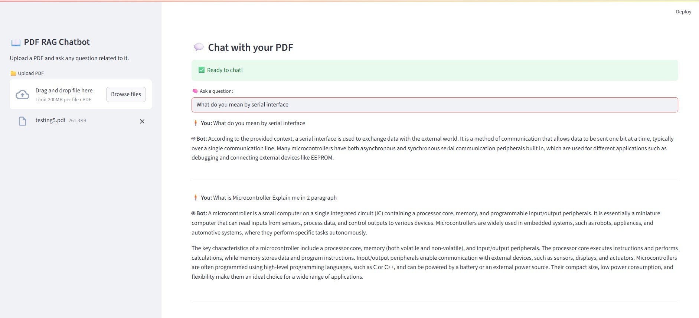

# PDF Question Answering System Using RAG
This project implements a Retrieval-Augmented Generation (RAG) system that allows users to ask questions about the content of a PDF document. The system uses LangChain, HuggingFace embeddings, ChromaDB for vector storage, and Chat Groq for generating answers.

---

## System UI



```markdown
# 📄 PDF Question Answering System Using RAG

This project implements a **Retrieval-Augmented Generation (RAG)** system that allows users to ask questions about the content of a PDF document. The system uses **LangChain**, **HuggingFace embeddings**, **ChromaDB** for vector storage, and **Chat Groq** for generating answers.

---


---


## 🧠 Overview

The pipeline includes the following components:

1. **PDF Document Loading** using `UnstructuredPDFLoader`
2. **Text Splitting** using `RecursiveCharacterTextSplitter` (Parent-Child strategy)
3. **Embedding Generation** using HuggingFace's `all-MiniLM-L6-v2`
4. **Vector Storage** using ChromaDB
5. **Document Retrieval** using `ParentDocumentRetriever`
6. **Prompting & LLM** using Chat Groq via LangChain
7. **Question Answering** using a RAG chain

---

## 📁 Project Structure

```
.
├── data/
│   └── test.pdf        # Input PDF file
├── chroma_db/          # Chroma vectorstore persistence
├── README.md           # This file
└── rag_pipeline.ipynb  # Main Jupyter notebook
```

---

## 🛠️ Dependencies

Make sure to install the following packages:

```bash
pip install langchain langchain-community langchain-google-genai unstructured chromadb sentence-transformers python-dotenv
```

Also, you'll need to set up a Chat Groq API key for Chat Groq. Store it in a `.env` file:

```env
CHAT_GROQ_API_KEY=your_api_key_here
```

---

## 📦 Key Components

### 1. PDF Loader

```python
from langchain_community.document_loaders import UnstructuredPDFLoader

loader = UnstructuredPDFLoader(
    file_path="../data/test.pdf",
    mode="paged",
    strategy="auto",
    encoding="utf-8"
)
docs = loader.load()
```

### 2. Text Splitter

```python
from langchain.text_splitter import RecursiveCharacterTextSplitter

child_splitter = RecursiveCharacterTextSplitter(chunk_size=200, chunk_overlap=20)
parent_splitter = RecursiveCharacterTextSplitter(chunk_size=1000, chunk_overlap=200)
```

### 3. Embeddings

```python
from langchain.embeddings import HuggingFaceEmbeddings

embedding_model = HuggingFaceEmbeddings(
    model_name="sentence-transformers/all-MiniLM-L6-v2"
)
```

### 4. Vector Store

```python
from langchain.vectorstores import Chroma

vectorstore = Chroma(
    collection_name="pdf_chunks",
    embedding_function=embedding_model,
    persist_directory="../chroma_db"
)
```

### 5. Document Retriever

```python
from langchain.retrievers import ParentDocumentRetriever
from langchain.storage import InMemoryStore

retriever = ParentDocumentRetriever(
    vectorstore=vectorstore,
    docstore=InMemoryStore(),
    child_splitter=child_splitter,
    parent_splitter=parent_splitter,
)

retriever.add_documents(filtered_docs)
```

### 6. LLM and Prompt

```python
from langchain_core.prompts import PromptTemplate
from langchain_google_genai import ChatGoogleGenerativeAI
from langchain_core.output_parsers import StrOutputParser

prompt_template = PromptTemplate(...)

llm = ChatGroq(
    model="model-name",
    temperature=0,
    max_retries=3
)
parser = StrOutputParser()

### 7. RAG Chain

```python
from langchain.schema.runnable import RunnableSequence, RunnableLambda, RunnablePassthrough

rag_chain = RunnableSequence(
    {
        "question": RunnablePassthrough(),
        "context": retriever_chain
    },
    format_inputs,
    prompt_template,
    llm,
    parser
)
```

---

## 🤖 Example Usage

Ask a question like:

```python
question = "What is MicroController?"
response = rag_chain.invoke({"question": question})
print(response)
```

Output:
```
🤖 Chatbot says:
A microcontroller is a compact integrated circuit designed to govern a specific operation in an embedded system...
```

Another example:

```python
question = "Explain me in summarized form about CAN principle"
response = rag_chain.invoke({"question": question})
print(response)
```

---

## 📁 Data Requirements

Place your PDF file inside the `data/` folder and name it `test.pdf`, or update the file path accordingly in the code.

---

## 📌 Notes

- The system uses a **parent-child document retrieval strategy** to balance context richness and efficiency.
- All vector data is stored in `chroma_db/` for persistence.
- You can change the LLM or embedding model by updating the respective sections.

---

## 🚀 Future Improvements

- Add support for multiple PDFs
- Implement web UI using Streamlit or Gradio
- Use FAISS instead of Chroma for vector storage
- Add caching for frequent queries

---

## ✅ License

This project is licensed under the MIT License – see the [LICENSE](LICENSE) file for details.

---


